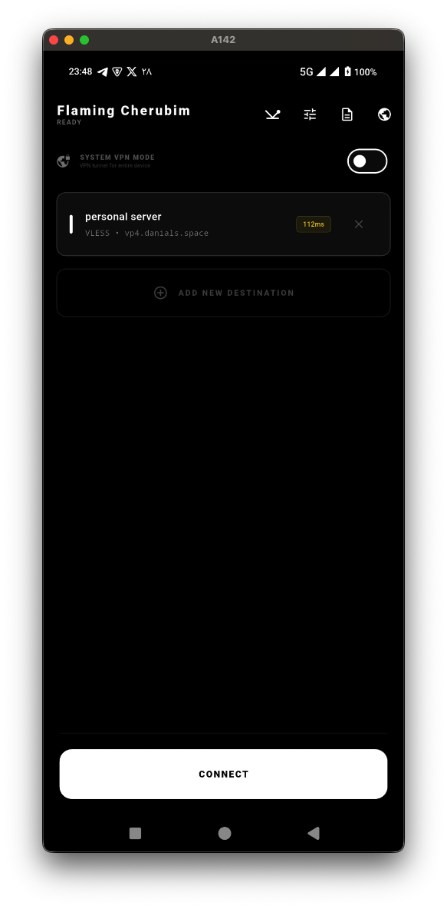
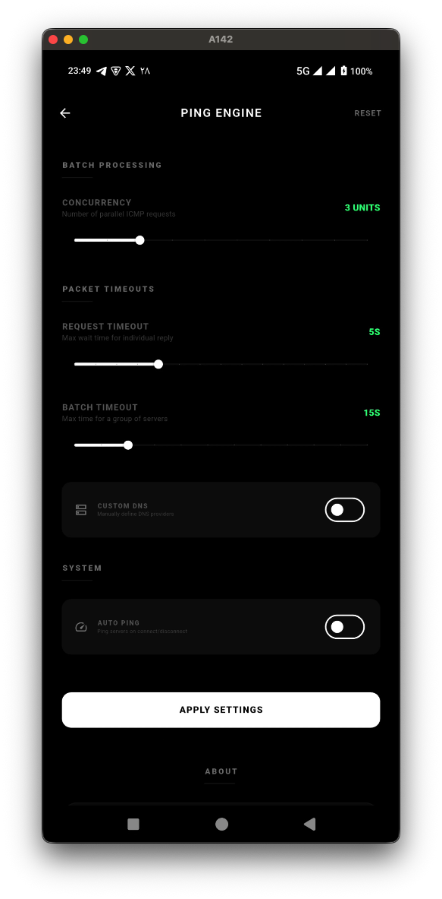
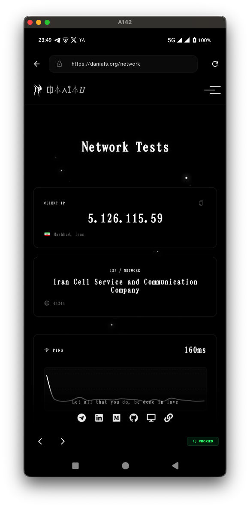

# Flaming Cherubim

A fast, modern, and high-performance V2Ray VPN client built with Flutter.
- **Android**: Full system VPN support.
- **macOS**: High-performance Proxy support (SOCKS/HTTP).

Uses a custom native plugin to run the official V2Ray core directly.

## Features

### Protocol Support

Full support for VMess and VLESS protocols, custom TLS settings (SNI, ALPN, fingerprint spoofing), and Reality and XTLS support.

### Connection Modes

VPN Mode provides full system VPN with traffic routing for all apps. Proxy-Only Mode offers local SOCKS5 (10808) and HTTP (10809) proxy without VPN overhead.

### Advanced Features

- Custom ping settings with configurable auto-ping intervals and methods (TCP/HTTP)
- Minimal UI with clean, dark-themed interface
- Comprehensive logging with real-time logs from app, V2Ray core, and tun2socks
- Kill switch for graceful shutdown protection when app crashes
- Built-in browser that opens to https://danials.org/network for speed and latency testing, with all traffic automatically proxied and full URL input and navigation
- DNS leak protection to prevent DNS queries from bypassing the VPN
- Intelligent server selection to auto-select fastest server based on ping

## Disclaimer

> [!NOTE]
> I coded this over the weekends, it might have bugs and it's not production-ready, and the macos version is fully vibe coded.

## Full Documentation

For complete documentation about the app architecture, features, and technical details, see [DOCUMENTATION.md](DOCUMENTATION.md).

## License

GNU General Public License v3.0 (GPL-3.0)
