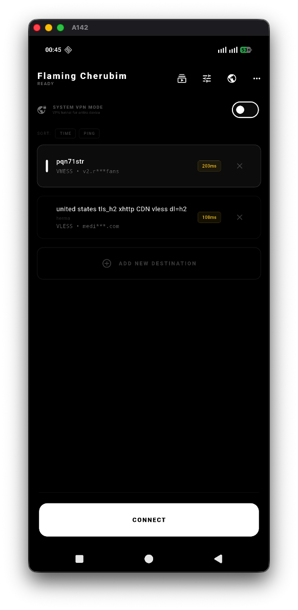
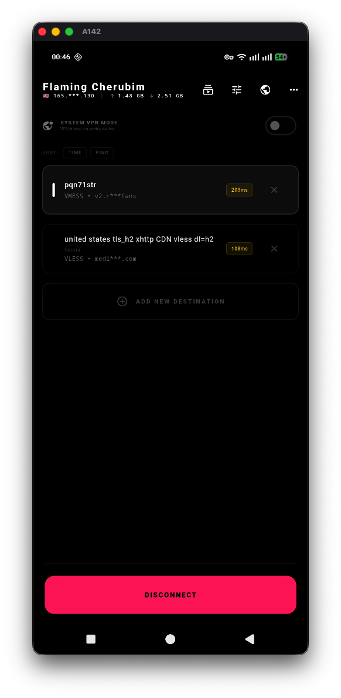
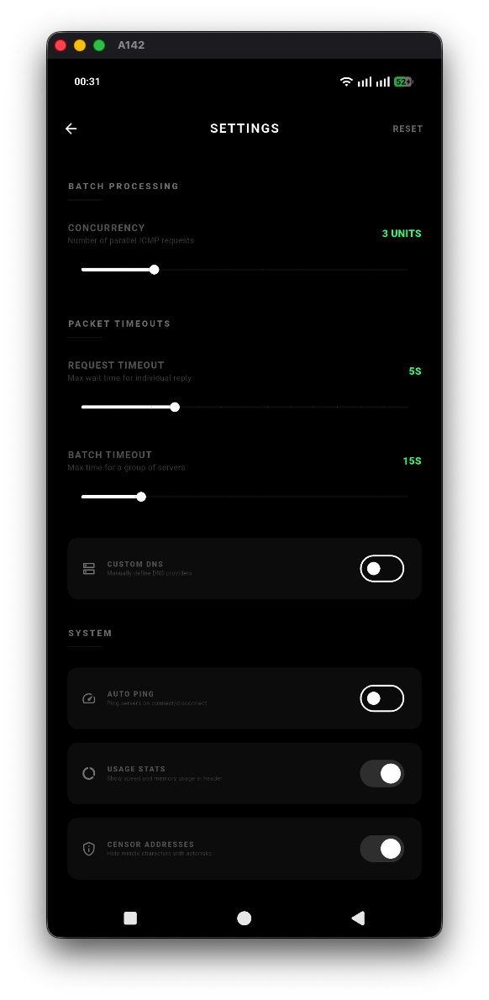
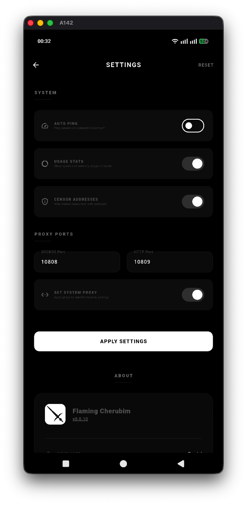
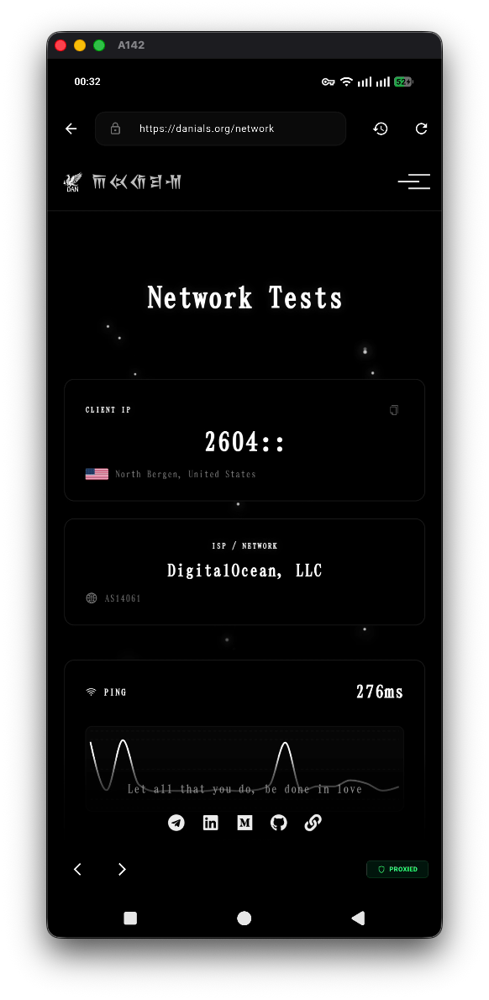
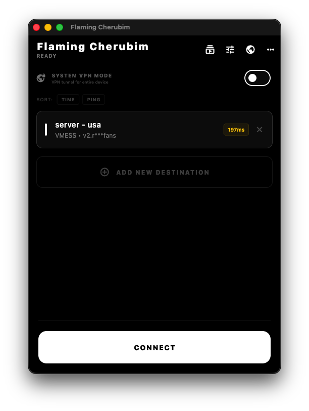
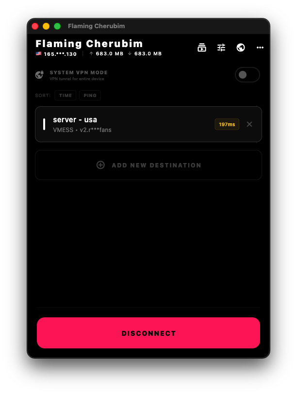
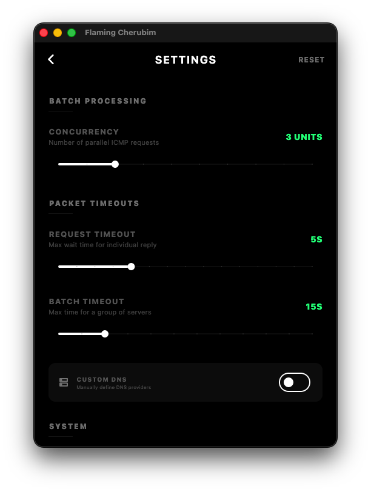
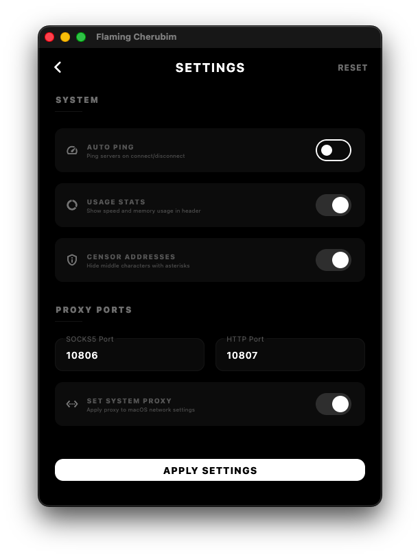
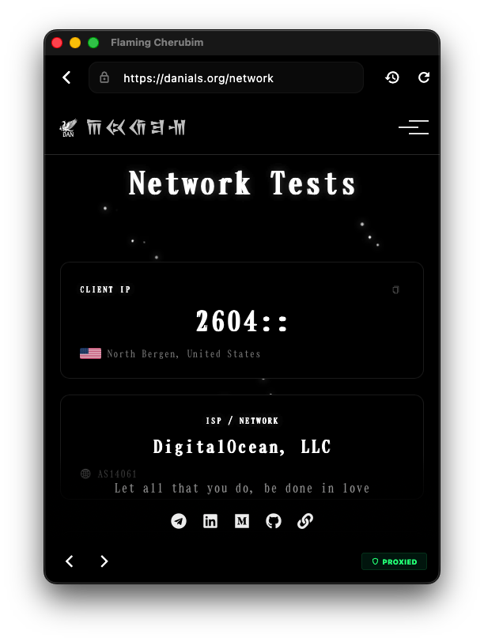

# Flaming Cherubim

A fast, modern, and high-performance V2Ray VPN client built with Flutter.
- **Android**: Full system VPN via Android VpnService.
- **macOS**: Full system VPN via tun2socks + utun, also supports proxy-only mode.

Uses a custom native plugin to run the official V2Ray core directly.

### Android







### macOS








## Features

### Protocol Support

Full support for VMess and VLESS protocols, custom TLS settings (SNI, ALPN, fingerprint spoofing), and Reality and XTLS support.

### Connection Modes

**VPN Mode** provides full system VPN with traffic routing for all apps. On macOS, this uses tun2socks + a utun interface with root-based routing — no paid Apple Developer membership needed.

**Proxy-Only Mode** offers local SOCKS5 (10808) and HTTP (10809) proxy without VPN overhead.

### Subscription Management

Subscribe to server lists via URL. Parses the `subscription-userinfo` header to show remaining days, traffic used/total, and expiry. Expand subscriptions to view all imported servers.

### Advanced Features

- Custom ping settings with configurable intervals and methods
- Home screen widgets for connection control and status (Android)
- Real-time traffic monitoring and RAM usage indicators
- Minimal UI with clean, dark-themed interface
- Comprehensive logging and diagnostics
- Kill switch for graceful shutdown protection
- Built-in browser with automatic proxy routing
- DNS leak protection and intelligent server selection
- Privacy censorship mode for server addresses
- QR code sharing and scanning for server import/export

## How macOS VPN Works (TL;DR)

```
Your apps → utun100 → tun2socks → V2Ray SOCKS5 (127.0.0.1) → Server → Internet
```

- **utun100**: A virtual network interface created by tun2socks. All internet traffic is routed through it.
- **tun2socks**: Bridges raw TUN packets to SOCKS5 proxy connections, forwarding them to V2Ray running locally.
- **V2Ray**: Encrypts and sends traffic to your configured server via VLESS/VMess/Reality.

No Apple Network Extension entitlement needed — just admin password (or Touch ID) approval

## Disclaimer

> [!NOTE]
> I coded this over the weekends, it might have bugs and it's not production-ready, and the macos version is fully vibe coded.

## Full Documentation

For complete documentation about the app architecture, features, and technical details, see [DOCUMENTATION.md](DOCUMENTATION.md).

## License

GNU General Public License v3.0 (GPL-3.0)
